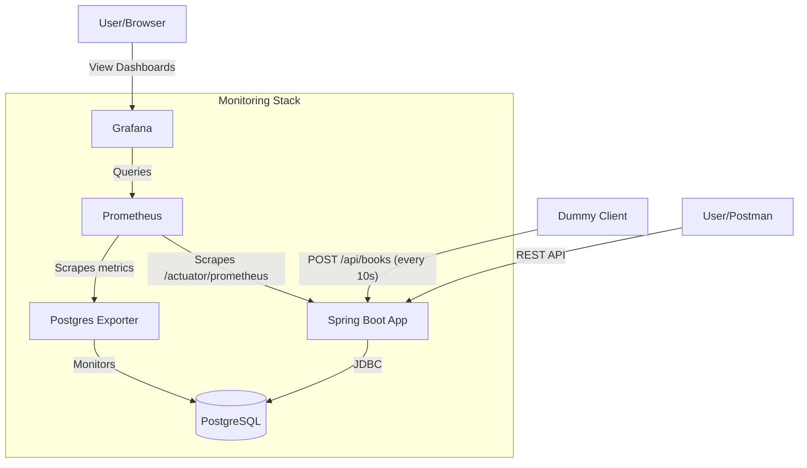

# Library Management System - Monitoring & Deployment

A Spring Boot CRUD application integrated with PostgreSQL and a full observability stack (Prometheus, Grafana, and Postgres Exporter).

## Architecture & Communication

The following diagram illustrates how the containers interact:



## Containers Overview

| Container | Role | Port |
|-----------|------|------|
| `library-app` | Spring Boot REST API | 8080 |
| `library-db` | PostgreSQL Database | 5432 |
| `dummy-client` | Python script adding data automatically | N/A |
| `prometheus` | Time-series database for metrics | 9090 |
| `postgres-exporter` | Translates Postgres stats for Prometheus | 9187 |
| `grafana` | Visualization dashboard | 3000 |

## Monitoring Implementation

### 1. Spring Boot Metrics
We use **Spring Boot Actuator** and **Micrometer Prometheus** to expose application-level metrics.
- **Endpoint:** `http://localhost:8080/actuator/prometheus`
- **Tracked data:** JVM memory, HTTP request latency, active connections, etc.

### 2. Database Metrics
Since Prometheus cannot talk directly to Postgres, we use `postgres-exporter`.
- It connects to the database and exposes internal Postgres statistics (active sessions, transactions, row locks) in a format Prometheus understands.

### 3. Automated Data Generation
The `dummy-client` ensures there is constant activity in the system, which makes the monitoring graphs more interesting to watch in real-time.

## How to Run

1. **Start the stack:**
   ```bash
   docker-compose up --build
   ```

2. **Access the Monitoring:**
   - **Grafana:** [http://localhost:3000](http://localhost:3000) (User: `admin` | Pass: `admin`)
   - **Prometheus:** [http://localhost:9090](http://localhost:9090)

3. **Setting up Grafana Dashboards:**
   - Log in to Grafana.
   - Go to **Connections > Data Sources** and add **Prometheus**.
   - URL: `http://prometheus:9090`
   - Click **Save & Test**.
   - **Import Dashboards:**
     - For Spring Boot: Import ID `11378` or `12900`.
     - For Postgres: Import ID `9628`.

## API Endpoints (Postman)
- `GET /api/books` - List books.
- `POST /api/books` - Add a book manually.
